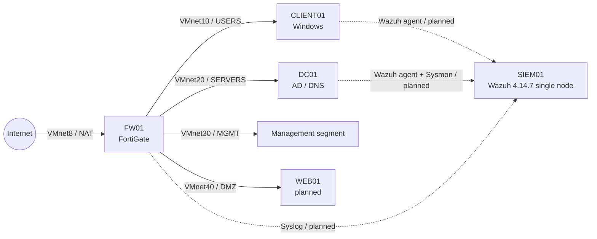

# Enterprise Cybersecurity Implementation & Detection Engineering Lab

An engineering portfolio documenting a segmented enterprise home lab, a Wazuh-based SOC platform, and Linux endpoint detections mapped to MITRE ATT&CK. The emphasis is architecture, detection logic, validation discipline, investigation, and safe reproducibility—not a generic installation tutorial.

> Evidence standard: **Verified** means the lab owner confirmed the result through observed telemetry. Repository screenshots or logs are identified separately. Rule definitions alone never prove successful detection.

## Architecture



FW01 remains the routing and policy boundary. SIEM01 is one physical Ubuntu laptop running the containerized Wazuh Manager, Indexer, and Dashboard plus a host-installed agent. See [network architecture](architecture/network-architecture.md), [SIEM data flow](architecture/siem-data-flow.md), and [attack chain](architecture/attack-chain.md).

## Technologies

| Area | Technology | Role |
|---|---|---|
| Virtualization | VMware Workstation | Isolated enterprise networks and virtual systems |
| Network security | FortiGate / FW01 | Segmentation, routing, NAT, future Syslog source |
| Identity | Windows Server / DC01 | Active Directory and DNS |
| Endpoint | Windows / CLIENT01 | User workstation and future Sysmon source |
| SIEM/XDR | Wazuh 4.14.7 | Collection, analytics, FIM, hunting, alerting |
| Platform | Ubuntu 26.04 LTS, Docker Compose | Physical SIEM01 and single-node deployment |
| Linux telemetry | Auditd, journald, Syscheck | Process, authentication, and file activity |
| Detection content | Wazuh XML, CDB lists | Rules, lookups, frequency and stage correlation |

## Detection catalog

| ID | Capability | ATT&CK | Status |
|---|---|---|---|
| DET-001 | SSH invalid user | T1110 | Verified by owner |
| DET-002 | Suspicious command marker | T1059 | Verified by owner |
| DET-003 | Repeated command correlation | T1059 | Verified by owner |
| DET-004 | Auditd command execution | T1059 | Verified by owner |
| DET-005 | Suspicious tool lookup | T1059 | Implemented; evidence pending |
| DET-006 | File integrity monitoring | T1565.001 | Verified by owner |
| DET-007 | Sudo privilege escalation | T1548.003 | Verified by owner |
| DET-008 | Cron persistence | T1053.003 | Implemented; evidence pending |
| DET-009 | Account manipulation | T1136.001, T1098.007 | Implemented; collision documented |
| DET-010 | Localhost network reconnaissance | T1046 | Implemented; evidence pending |
| DET-011 | Localhost HTTP beacon correlation | T1071.001 | Implemented; evidence pending |
| DET-012 | Multi-stage attack correlation | Multiple | Implemented; final verification pending |

The authoritative status register is [DETECTION_CATALOG.md](docs/DETECTION_CATALOG.md). Detailed runbooks are in [detection-docs](detection-docs/README.md).

## Investigation workflow

1. Triage rule, severity, endpoint, time range, and source.
2. Validate the raw event and decoded fields.
3. Pivot across Auditd, Syscheck, authentication, process, and network context.
4. Build a timeline and separate expected administration from suspicious behavior.
5. Record evidence, scope, ATT&CK mapping, false positives, and tuning decisions.
6. Contain only with explicit authorization; this project does not automate response.

See [Threat Hunting](docs/threat-hunting.md) and the evidence-aware [incident report](incident-reports/INC-001-multi-stage-attack.md).

## Evidence

No sanitized detection screenshots are currently committed. Existing source images found outside this repository require redaction before publication; no screenshots are invented.

## Repository map

```text
architecture/       Network, telemetry, and attack-chain designs
deployment/         Sanitized deployment examples only
detections/         Sanitized Wazuh, CDB, and Auditd content
detection-docs/     Detection specifications and safe test runbooks
docs/               Project context, implementation, hunting, roadmap
incident-reports/   Evidence-aware investigation reports
screenshots/        Approved, sanitized visual evidence
```

## Security and sanitization

This public-facing repository excludes credentials, keys, certificates, `.env` files, infrastructure exports, transient IP addresses, and workplace information. Configuration files are sanitized examples, not backups. Read [PROJECT_CONTEXT.md](docs/PROJECT_CONTEXT.md) before contributing.

## Roadmap

- Give SIEM01 a predictable home address through DHCP reservation.
- Enroll CLIENT01 and DC01; add Sysmon and Windows telemetry.
- Send FortiGate Syslog to SIEM01.
- Develop cross-source endpoint, identity, and network detections.
- Validate DET-012 and publish sanitized evidence.
- Complete a Windows/Active Directory incident scenario.

## Skills demonstrated

VMware networking, network segmentation, FortiGate administration, Active Directory, Wazuh SIEM/XDR, Docker, Linux Auditd, Sysmon planning, Windows Event Logging, File Integrity Monitoring, Threat Hunting, Detection Engineering, correlation, MITRE ATT&CK mapping, incident investigation, and Git/GitHub.

## Safe use

All procedures are for explicitly authorized lab systems. Reconnaissance and HTTP simulations use `127.0.0.1`; they must not be redirected to workplace or external systems without authorization.
