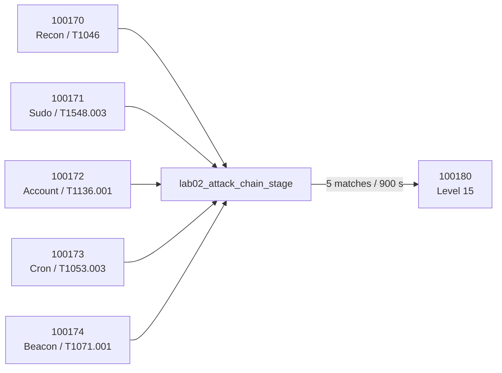

# Multi-stage Correlation Design

Rule 100180 is designed to correlate five stage-group matches within 900 seconds and suppress repeats for 600 seconds. This is an implementation design; successful final firing remains unverified.
