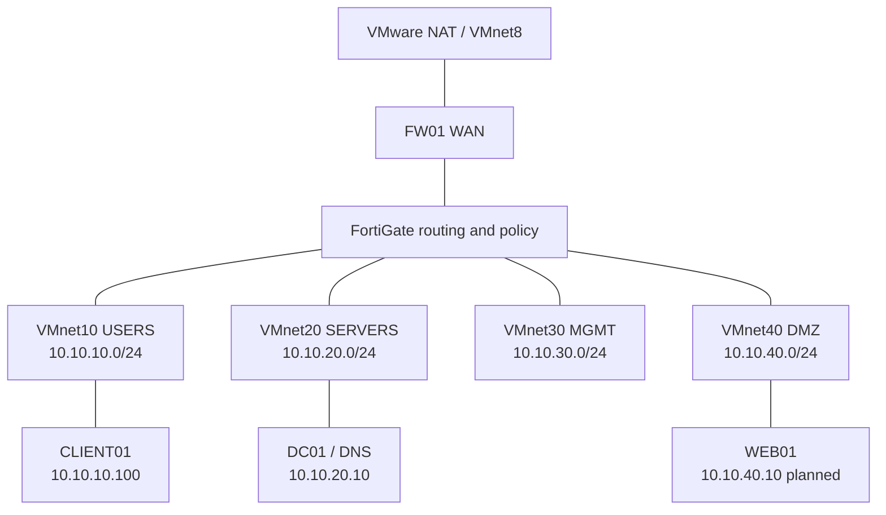

# Network Architecture

CLIENT01 uses `10.10.10.1` as gateway and DC01 as DNS. Required AD/DNS flows are allowed; USERS-to-MGMT, USERS-to-DMZ, and DMZ-to-DC01 are restricted by intent. Internet access is controlled through FW01/NAT, with no unnecessary inbound exposure.
