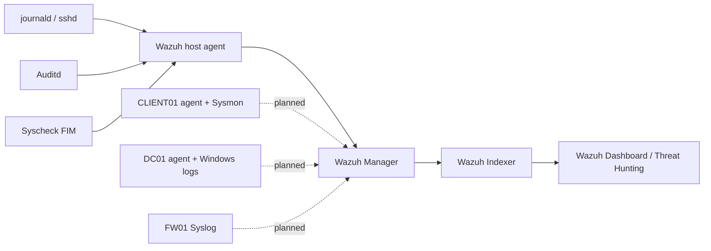

# SIEM Data Flow

```mermaid
flowchart LR
  J[journald / sshd] --> A[Wazuh host agent]
  AU[Auditd] --> A
  F[Syscheck FIM] --> A
  A --> M[Wazuh Manager]
  M --> I[Wazuh Indexer]
  I --> D[Wazuh Dashboard / Threat Hunting]
  C[CLIENT01 agent + Sysmon] -. planned .-> M
  DC[DC01 agent + Windows logs] -. planned .-> M
  FW[FW01 Syslog] -. planned .-> M
```

Current documentation covers the SIEM01 Linux telemetry path. Windows and FortiGate inputs are planned, not operationally verified.
